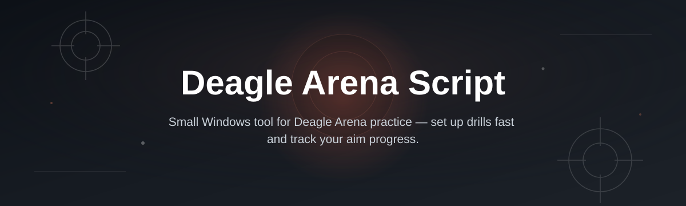
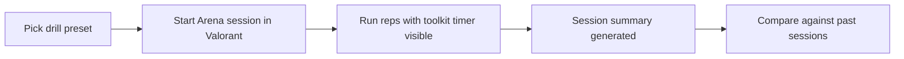

# deagle-arena-val-toolkit

*A structured practice companion for players who want their Deagle Arena reps to actually mean something.*

## What this is

The short version: I built this because I got tired of "practicing" the Deagle by clicking on bots for ten minutes and calling it a day.

 

deagle-arena-val-toolkit is a standalone Windows companion built around one specific problem in Valorant's Range: the Deagle punishes bad habits in ways other guns don't, and the default Arena mode gives you almost no way to structure repeatable drills around that. I started this as a personal script to log my own one-tap sessions — timing between shots, hit sequences on moving bots, reset patterns — and it grew into a small toolkit once a few friends asked to use it too. It's not a Valorant mod, it doesn't touch the game client, and it never will; it's a separate app that sits alongside the Range and helps you plan and track what you're actually training.

The core idea is simple: the Deagle rewards consistency more than reaction speed, so the toolkit is built around repeatable session structures rather than random spray practice. You pick a drill format, run it in the Arena, and the toolkit tracks pacing and gives you a layout to follow — no game files touched, no overlays injected into the client, nothing that talks to Vanguard.

  

The button above opens the project page, where the current build is available to download.

## Who it is for

- Players stuck around Gold–Diamond who keep buying the Deagle but can't hit consistent one-taps under pressure.
- Anyone who wants a repeatable warm-up routine before ranked instead of ten aimless minutes in the Range.
- Coaches or IGLs who run structured practice blocks for teammates and want a shared drill format.
- Content creators who record Arena sessions and want clean, comparable runs across videos.
- Controller-to-KBM switchers who need deliberate, slow-down drills specifically for the Deagle's timing.

## What you can do

| Capability | What it actually does |
|---|---|
| **Session builder** | Set up a Deagle-focused drill (static, strafing, or peek-based) with a target rep count before you enter the Range. |
| **Pace tracking** | Logs time-between-shots locally so you can see if you're rushing your first bullet. |
| **Drill presets** | Ships with a handful of Deagle-specific layouts (close-range duel, mid-range hold, wide peek) instead of generic aim-trainer routines. |
| **Session history** | Keeps a local log of past sessions so you can compare this week to last, no account needed. |
| **Custom reps** | Adjust rep count, rest intervals, and target count per session instead of using fixed defaults. |
| **Export summary** | Save a session as a simple text/CSV summary if you want to track progress outside the app. |
| **Offline-first** | Everything runs locally; no background service, no telemetry beyond what you choose to export. |
| **Lightweight UI** | Single window, no launcher bloat, closes cleanly when you're done. |

## Getting started

1. Open the landing page using the download button above.
2. Download the current Windows build listed there.
3. Extract the folder anywhere on your machine — no installer runs in the background.
4. Launch the executable, pick a Deagle drill preset, then start the matching Arena session in Valorant.
5. Run the drill, check your pace summary when you're done, and adjust the next session accordingly.

## Requirements

- Windows 10 or 11 (64-bit).
- No .NET, Python, or Node toolchain needed — it's a standalone executable.
- Valorant installed and the Range/Arena accessible; the toolkit runs alongside it, not inside it.
- Roughly 100 MB of free disk space for the app and your session logs.

## How it works

1. You choose a Deagle drill preset (or build a custom one) in the toolkit window.
2. The toolkit shows you the rep structure and timing target for that drill.
3. You start the corresponding Arena/Range routine in Valorant and run it as shown.
4. The toolkit's timer window tracks pace passively — it reads nothing from the game process.
5. When the session ends, you get a summary you can save, compare, or ignore.

## FAQ

**Is this a script that modifies Valorant itself?**
No. It never reads or writes game memory or files. It's a separate window you run next to the Range.

**Does using this risk a Vanguard flag?**
The toolkit doesn't inject into, hook, or communicate with the Valorant process in any way, so there's nothing for Vanguard to detect — it's just a timer and drill planner.

**What counts as a "Deagle Arena" drill here?**
Any repeatable Range routine focused on the Deagle: static one-taps, strafe resets, or peek-and-hold sequences, run in fixed rep blocks instead of open-ended clicking.

**Can I use this for guns other than the Deagle?**
The presets are tuned around Deagle timing, but the session builder works for any single-shot weapon if you set your own pace targets.

**Do I need an account or internet connection to use it?**
No. Session data stays on your machine unless you choose to export it.

## Troubleshooting

- **The app won't launch on first run** — right-click the executable, choose "Run as administrator" once; Windows SmartScreen sometimes blocks new unsigned builds on the first launch only.
- **Session timer feels off compared to in-game pace** — check your display refresh rate; the timer is tied to system clock, not game frame timing, so very low FPS in Valorant can make reps feel out of sync with the counter.
- **Exported CSV won't open correctly** — make sure you're opening it with a plain text editor or spreadsheet app set to comma delimiters; some regional Excel settings default to semicolons.
- **Drill presets don't match what I expected** — presets assume default Range bot settings; if you've changed bot speed or count, build a custom session instead of using a preset.

## License

Released under the [MIT License](LICENSE). This is an independent fan-made practice companion, not affiliated with or endorsed by Riot Games. Use it alongside Valorant at your own discretion.

  

